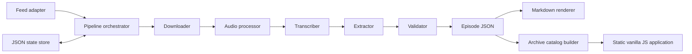

# FFW Architecture

## System boundary

The frontend consumes generated JSON through HTTP. It does not import Python, read state, call a model, or know which orchestration host produced the archive.

## Package responsibilities

| Module | Responsibility |
|---|---|
| `interfaces.py` | Protocol contracts for replaceable adapters. |
| `mocks.py` | Credential-free feed, download, audio, transcription, and extraction fixtures. |
| `pipeline.py` | Stage ordering, transitions, failure handling, and publication. |
| `state.py` | Atomic durable operational state and transition history. |
| `validation.py` | Cross-file and trust-invariant validation. |
| `rendering.py` | Deterministic episode Markdown. |
| `archive.py` | Master episode index and flattened card catalog. |
| `cli.py` | Thin local operator interface and static server. |

## Storage

- `state/episodes.json` is mutable pipeline state keyed by GUID.
- `archive/episodes/*/metadata.json` contains episode and pipeline audit metadata.
- `archive/episodes/*/summary.json` is canonical extracted data.
- `archive/episodes/*/summary.md` is derived human-readable output.
- `archive/index.json` and `archive/cards.json` are rebuildable catalog projections.
- `.ffw-work/` is disposable stage workspace and ignored by Git.

All durable writes use a same-directory temporary file followed by replacement. A completed state is written only after episode outputs exist. The current mock intentionally keeps a failed fixture terminal; `backfill` forces a fresh attempt.

## Production adapter plan

### Feed

Implement `FeedSource` with a standard-library or approved RSS parser. Identity must prefer item GUID and fall back to an enclosure URL hash only when GUID is absent. Iterate all retained feed items rather than comparing only the newest item.

### Downloader and audio

Stream to temporary storage with size and content-type guards. A future `ffmpeg` adapter should normalize spoken-word audio and split uploads below the transcription provider's limit without retaining MP3s in Git.

### Transcription

Implement the existing `Transcriber` protocol. Persist model name and usage. Carry a Magic card-name glossary and preceding-chunk context, then evaluate card names, prices, negation, and timestamps.

### Extraction

Use schema-constrained output. Locate the Cards to Watch boundaries before extraction; do not summarize the entire transcript. The model must emit null for unsupported fields and route ambiguity to review.

### Scheduling

GitHub Actions can later call the same CLI with repository secrets and `contents: write`. Pipeline logic must remain here, not inside workflow YAML. Use an Actions concurrency group and a non-top-of-hour schedule.

## Idempotency boundary

FFW guarantees idempotent publication: one catalog identity per GUID and deterministic output paths/IDs. No process can guarantee an external API is called exactly once if a runner dies after the provider responds but before a durable checkpoint. If avoiding even rare repeated transcription charges becomes important, add durable stage blobs or a transactional database in a later phase.

## Security and trust

- Treat RSS strings, transcript text, and model output as untrusted data.
- The browser escapes dynamic values before placing them in HTML.
- Production URLs need protocol, redirect, content-length, and MIME validation.
- Secrets belong in the scheduler's secret store, never JSON, state, logs, or frontend files.
- Evidence excerpts should be short; raw audio and complete transcripts are not archive requirements.

