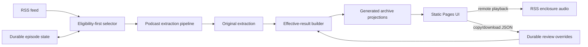
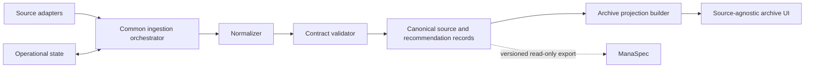
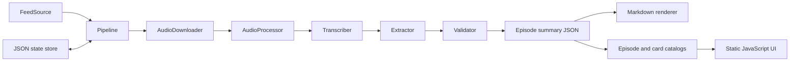

# ManaIntel Architecture

## Maintenance-mode boundary

The supported system is the existing single-podcast FFW pipeline and static archive. The source-agnostic target below is retained as historical design context, not an active implementation roadmap. The final pass adds correction and playback seams without introducing a backend, database, authentication layer, or additional adapter.



The final arrow into review overrides is a manual repository step: the browser produces a file but cannot write to GitHub directly.

## Eligibility-first selection

Selection is a dedicated pre-acquisition layer:

1. Fetch the complete available feed window.
2. Load GUID-keyed durable state.
3. Filter for the requested policy (`next`, `backfill`, `failed_only`, or exact GUID).
4. Apply deterministic ordering.
5. Apply the attempt limit.
6. Acquire and process only the selected episodes.

An empty selection exits before state transitions or catalog generation. The workflow must also use the resulting changed/no-change signal to avoid an unchanged Pages deployment.

## Durable input and generated output boundary

Durable source data includes episode state, configuration, exclusions, and `data/reviews/*.json`. Original extraction is retained as immutable machine output for audit. Review files are validated manual input and must not be deleted or rewritten by render, retry, cleanup, or backfill operations.

Generated output includes Markdown summaries, effective episode JSON views, flattened card catalogs, indexes, and the Pages artifact. It is safe to rebuild only from original extraction plus durable manual inputs. Generation failure must not silently discard a correction or replace the last valid published archive.

## Effective review rendering

The effective-result builder applies override actions by stable pick ID:

```text
original extraction + update/add/exclude overrides = effective reviewed result
```

Override application occurs before Markdown and archive projection generation. It never mutates the original summary. Invalid schemas, missing update/exclude targets, duplicate operations, or invalid timestamps fail with a readable validation error.

## Browser audio playback

The static episode page reads an enclosure URL already present in archive data. A timestamp link adds `t=<seconds>` to the episode URL. The player waits for `loadedmetadata`, clamps the requested time to a valid duration, seeks, then attempts playback. Autoplay denial leaves the player ready for one click. Media errors show the original episode link; audio remains remote and disposable.

## Historical source-agnostic target (deferred)



The canonical boundary begins after normalization. Everything downstream of it operates on sources, source items, recommendations, and generic source references. It must not need to know whether input came from an RSS enclosure, video captions, HTML, or a community post.

## Source adapter contract

An adapter may implement different internal stages, but it has the same responsibilities:

1. Identify the source and discover source items.
2. Produce a stable external or derived identity for each item.
3. Acquire content within the source's permissions and retention rules.
4. Locate relevant recommendation material.
5. Extract source-attributed recommendations without adding analysis.
6. Attach a verifiable locator and compact evidence.
7. Normalize into the common contract.
8. Report processing, confidence, and review information.

Example adapter flows:

```text
Podcast: RSS -> audio -> transcript -> timestamped recommendation
Video:   feed/API -> captions -> timestamped recommendation
Article: feed/index -> HTML -> section/paragraph recommendation
Community: permitted API/export -> post/thread -> message reference
```

Acquisition and extraction interfaces can vary behind the adapter. The normalized output cannot.

## Layer responsibilities

| Layer | Responsibility |
|---|---|
| Source registry | Source identity, type, attribution, adapter configuration, and policy metadata. |
| Adapter | Discovery, acquisition, source-specific parsing, and locator creation. |
| Orchestrator | Stage ordering, idempotency, retry, state transitions, and publication. |
| Normalizer | Maps adapter output to the common source-item and recommendation contract. |
| Validator | Enforces schema, provenance, evidence, and trust invariants. |
| Canonical store | Durable normalized records; independent of frontend needs. |
| Projection builder | Rebuildable search catalogs, summaries, and exports. |
| Archive UI | Search, filter, and source verification using only common projections. |

## Canonical versus operational data

- Canonical records describe sources, source items, and recommendations.
- Operational state describes attempts, stages, errors, model versions, and review workflow.
- Archive catalogs are disposable projections optimized for browsing and search.
- Raw downloads and full transcripts are temporary adapter artifacts unless a documented permission and operational need justify retention.

Keeping these roles separate prevents retries from altering published meaning and prevents frontend needs from becoming ingestion schema requirements.

## Current FFW implementation

The existing implementation is a production-shaped first adapter with podcast-specific types:



| Current module | Present responsibility | ManaIntel evolution |
|---|---|---|
| `interfaces.py` | Podcast feed/audio/extraction protocols. | Retain inside the podcast adapter; introduce a higher-level source-adapter contract. |
| `production.py` / `mocks.py` | Live and synthetic podcast stages. | Become implementation details of the FFW adapter. |
| `pipeline.py` | Podcast stage ordering and publication. | Reuse orchestration behavior while separating source-specific stages. |
| `state.py` | Atomic operational state keyed by episode GUID. | Key attempts by source plus source-item identity. |
| `validation.py` | Cross-file and podcast trust invariants. | Split common invariants from adapter-specific validation. |
| `rendering.py` | Deterministic episode Markdown. | Render generic source items, with optional adapter-specific derived views. |
| `archive.py` | Episode index and flattened card catalog. | Build neutral source-item and recommendation projections. |
| `web/` | Static episode/pick interface. | Replace episode-specific labels and fields with common source concepts. |

Current storage remains:

- `state/episodes.json`: mutable FFW pipeline state.
- `archive/episodes/*/metadata.json`: episode and processing audit metadata.
- `archive/episodes/*/summary.json`: canonical v1 podcast extraction.
- `archive/episodes/*/summary.md`: deterministic v1 rendering.
- `archive/index.json` and `archive/cards.json`: rebuildable v1 projections.
- `.ffw-work/`: disposable stage workspace.

These paths describe the current contract, not the required final ManaIntel layout.

### Revision 2 live operation

`Pipeline.from_settings()` selects either the network-free fixture adapters or the live adapters without changing orchestration. Live RSS entries are normalized to the same `EpisodeCandidate` boundary and pass through:

```text
detected -> queued -> downloading -> downloaded -> preparing
  -> transcribing -> transcribed -> extracting -> extracted
  -> validating -> publishing -> complete | needs_review
  -> failed from any stage (explicitly retryable)
```

The production catalog builder excludes synthetic episode folders even though fixture outputs remain in the repository for tests. GitHub Actions serializes writers, runs the Python pipeline and validation, commits `state/` and `archive/` only when changed, then packages `web/` plus the production archive at a clean Pages root. `.ffw-work/` never enters the durable artifact.

Before acquisition, one state-aware selector orders the full fetched feed newest to oldest and compares canonical GUIDs with durable state. Its `next`, `backfill`, `failed_only`, and `exact_guid` policies apply limits only after eligibility filtering. `complete` and `needs_review` are successful terminal states; `failed` is excluded from ordinary selection. The morning `next` schedule therefore guarantees untouched backfill progress, while the later `failed_only` schedule selects at most one due retryable record. Retry eligibility includes cooldown and maximum-attempt checks. Exact GUID selection searches the full feed. When selection is empty, orchestration returns without state transitions or catalog regeneration.

## Migration shape

The first ManaIntel change should be an additive compatibility layer:

```text
existing FFW summary -> FFW-to-ManaIntel normalizer -> common records -> new projections
```

This makes the architectural claim testable before adding another source. Once the archive and UI operate entirely on common records, a second adapter can prove that no source-specific branch is required downstream. Existing v1 output should remain readable until migration behavior and identifiers are validated.

## Idempotency and identity

Idempotency is scoped by source:

- A source is identified independently of its display name.
- A source item uses a stable publisher ID when available and a documented deterministic fallback otherwise.
- A recommendation ID derives from source item identity plus stable evidence/card identity, not array position.
- Reprocessing may update a record's extraction or review metadata without silently creating another logical recommendation.

Exactly-once external API use is not guaranteed if a runner dies between a provider response and a durable checkpoint. Durable stage artifacts or transactional storage can be added if cost or scale makes that necessary.

## Security, permissions, and trust

- Treat feed data, captions, HTML, transcript text, posts, and model output as untrusted.
- Validate fetched protocols, redirects, sizes, and content types.
- Store secrets only in an appropriate secret store.
- Define access, excerpt, and retention policy per source before enabling its adapter.
- Keep evidence short and attributable; do not build a shadow copy of restricted content.
- Escape dynamic values in the browser and validate outbound source URLs.
- Record extraction versions so recommendations can be audited and reproducibly regenerated where possible.

## Scaling boundary

Static JSON and Git-backed state are reasonable for the current cadence and fixture size. Move to a database or search service only when concurrent writers, review workflows, catalog size, query latency, or schema migrations create a demonstrated need. The common contract and projection boundary should allow that storage change without redesigning adapters or the UI.
